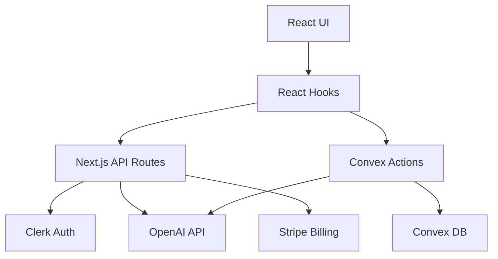

# MentoLoop GPT-5 Integration Template

Complete template for integrating GPT-5 capabilities into your MentoLoop healthcare mentorship platform.

## 📦 Template Files

- `gpt5-convex-actions.ts` - Convex backend actions for AI operations
- `prompt-engineering.ts` - Healthcare-specific prompt templates and utilities
- `api-routes.ts` - Next.js API routes with Clerk authentication
- `hooks-use-gpt5.ts` - React hooks for client-side AI features
- `gpt5-tests.spec.ts` - Playwright E2E testing suite

## 🚀 Quick Start

### 1. Environment Setup

Add to `.env.local`:
```bash
OPENAI_API_KEY=sk-your-openai-api-key
```

Add to Convex Dashboard:
```bash
OPENAI_API_KEY=sk-your-openai-api-key
```

### 2. Install Dependencies

```bash
npm install openai zod
```

### 3. Copy Template Files (mapped in this repo)

```bash
# Copy Convex actions
cp gpt5-convex-actions.ts convex/gpt5.ts

# Copy API routes
# In this repo, we've created:
# - app/api/gpt5/route.ts (chat, with streaming)
# - app/api/gpt5/documentation/route.ts (clinical documentation)

# Copy React hooks
cp hooks-use-gpt5.ts hooks/use-gpt5.ts

# Copy prompt library
# In this repo, we added lib/prompts.ts with validators/utilities

# Copy tests
cp gpt5-tests.spec.ts tests/gpt5-features.spec.ts
```

## 💡 Usage Examples

### AI-Powered Matching

```tsx
import { useAIMatching } from '@/hooks/use-gpt5';

function MatchingComponent() {
  const { findMatches, isMatching, matchResults } = useAIMatching();
  
  const handleMatch = async () => {
    const results = await findMatches(
      studentId,
      { specialty: 'Critical Care', learningStyle: 'visual' },
      { locationRadius: 25, experienceLevel: 'intermediate' }
    );
  };
  
  return (
    <Button onClick={handleMatch} disabled={isMatching}>
      {isMatching ? 'Finding Matches...' : 'Find AI Matches'}
    </Button>
  );
}
```

### Streaming Chat

```tsx
import { useGPT5Chat } from '@/hooks/use-gpt5';

function ChatComponent() {
  const { messages, sendMessage, streamingContent, isLoading } = useGPT5Chat();
  
  const handleSend = async (content: string) => {
    await sendMessage(content, { stream: true });
  };
  
  return (
    <div>
      {messages.map(msg => (
        <div key={msg.timestamp}>{msg.content}</div>
      ))}
      {streamingContent && <div>{streamingContent}</div>}
    </div>
  );
}
```

### Clinical Documentation

```tsx
import { useClinicalDocumentation } from '@/hooks/use-gpt5';

function DocumentationForm() {
  const { generateDocumentation, isGenerating } = useClinicalDocumentation();
  
  const handleGenerate = async () => {
    const doc = await generateDocumentation(
      sessionNotes,
      objectives,
      performanceData
    );
  };
}
```

## 🔌 MCP Tool Integration

### With Convex

```typescript
// Use existing Convex MCP tool
await ctx.runAction(api.gpt5.performMentorMatch, {
  studentId,
  preferences,
  matchingCriteria
});
```

### With Clerk

Authentication is automatically handled in API routes:
```typescript
const { userId } = await auth();
const user = await currentUser();
```

### With Stripe (for usage-based billing)

```typescript
// Track AI usage for billing
await ctx.runAction(api.billing.trackAIUsage, {
  userId,
  tokens: completion.usage.total_tokens,
  operation: 'mentor_matching'
});
```

## 🧪 Testing

Run Playwright tests:
```bash
npm run test:e2e -- gpt5-features.spec.ts
```

## 📊 Monitoring

Track GPT-5 usage in Convex:
```typescript
// convex/analytics.ts
export const trackAIMetrics = mutation({
  args: {
    operation: v.string(),
    tokens: v.number(),
    latency: v.number(),
    success: v.boolean(),
  },
  handler: async (ctx, args) => {
    await ctx.db.insert("aiMetrics", {
      ...args,
      timestamp: Date.now(),
    });
  },
});
```

## 🏗️ Architecture



## 🔒 Security Best Practices

1. **PHI Protection**: Validation functions prevent PHI in prompts
2. **Rate Limiting**: Built into API routes
3. **Input Sanitization**: XSS protection in all user inputs
4. **Clerk Auth**: All endpoints require authentication
5. **Audit Logging**: Track all AI operations in Convex

## 📈 Performance Optimization

- **Streaming**: Reduces perceived latency
- **Caching**: Store common responses in Convex
- **Debouncing**: Prevent excessive API calls
- **Token Management**: Automatic prompt optimization

## 🎯 Healthcare-Specific Features

- HIPAA-compliant documentation generation
- QSEN competency alignment
- Clinical reasoning chain-of-thought
- Nursing education best practices
- Evidence-based mentorship matching

## 🛠️ Customization

### Add New AI Operations

1. Create Convex action in `convex/gpt5.ts`
2. Add API route if needed
3. Create React hook
4. Add Playwright tests

### Modify Prompts

Edit `lib/prompts.ts` to customize:
- System prompts
- Few-shot examples
- Chain-of-thought patterns
- Output formats

## 📝 Notes

- Currently using `gpt-4-turbo-preview` until GPT-5 is available
- Streaming requires proper CORS configuration
- Consider implementing usage quotas per user tier
- Monitor costs through OpenAI dashboard

## 🤝 Support

For issues or questions about this template:
- Check the [MentoLoop Documentation](https://docs.mentoloop.com)
- Open an issue on GitHub
- Contact the development team

---

**Template Version**: 1.0.0  
**Compatible with**: MentoLoop v0.9.7+  
**Last Updated**: 2024
